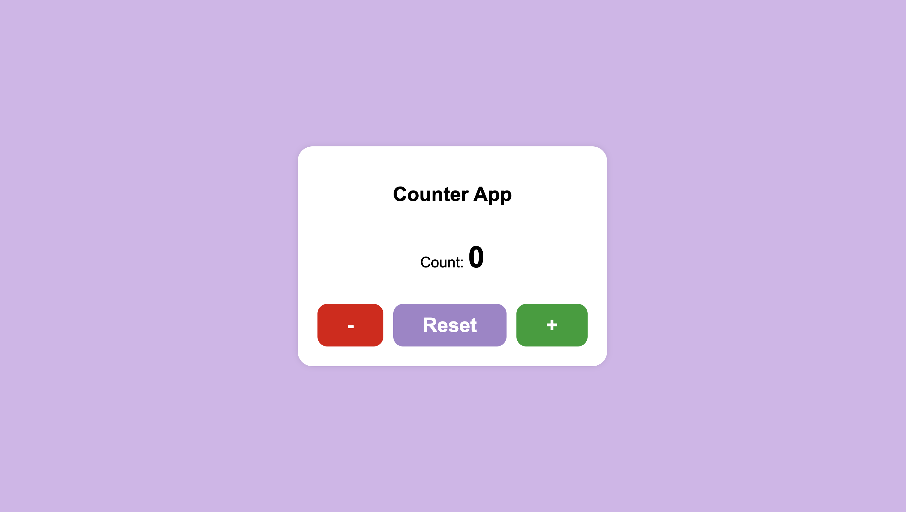
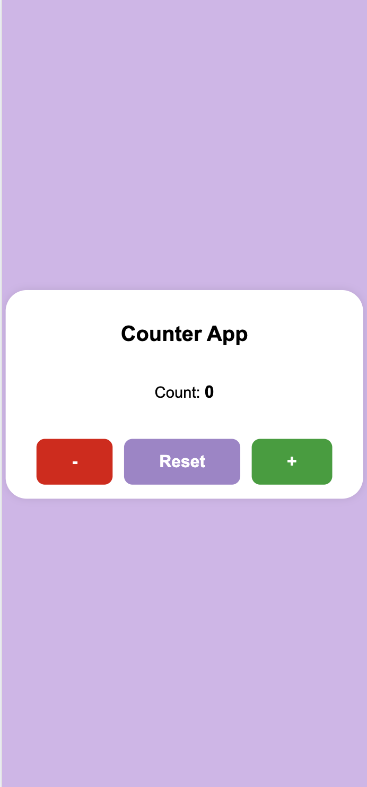

# Counter App

## Overview
A simple, accessible, and responsive counter application built with HTML, CSS, and JavaScript. The app allows users to increment, decrement, and reset a counter value. It is designed to be visually appealing and easy to use on both desktop and mobile devices.

---

## Features
- Increment, decrement, and reset the counter
- Responsive design for all screen sizes
- Accessible buttons with ARIA labels
- Modern, clean, and readable UI

---

## Screenshots

### Desktop View


### Mobile View


---

## Getting Started

### 1. Clone the repository
```bash
git clone https://github.com/your-username/counter-app.git
cd counter-app
```

### 2. Open the app
Open `index.html` in your browser.

---

## Usage
- Click the **+** button to increment the count.
- Click the **-** button to decrement the count.
- Click the **Reset** button to set the count back to 0.

---

## Design Choices

### Colors
- **Background:** Soft purple (`#d3b5ea`) for a calming, modern look.
- **Container:** White for high contrast and readability.
- **Buttons:**
  - **Increment:** Green (`#129e30`) to indicate a positive action.
  - **Decrement:** Red (`#e00000`) to indicate a negative action.
  - **Reset:** Purple (`#a084ca`) to match the theme and stand out as a neutral action.

### Fonts
- **Font Family:** Arial, sans-serif for clarity and wide compatibility.
- **Font Size:** Large, bold fonts for accessibility and easy reading on all devices.

### Layout
- **Centered container:** Uses Flexbox to center the app both vertically and horizontally.
- **Responsive design:** The layout adapts to different screen sizes, keeping the app usable and visually appealing on mobile and desktop.
- **Button group:** Buttons are placed in a row for easy access and clear separation of actions. On very small screens, horizontal scrolling is enabled to maintain button size and usability.

---

## Accessibility
- All buttons have descriptive `aria-label` attributes for screen readers.
- High color contrast for readability.
- Large clickable areas for touch devices.
- Keyboard accessible by default.

---

## Project Instructions

You can find the detailed project instructions and planning in this Google Doc:  
[Counter App Project Instructions](https://docs.google.com/document/d/1bXReN478wIwU74Ofr1J6hC8P6DCQYP8Q555KlXOFkyM/edit?usp=sharing)

---

## Contributing
Pull requests are welcome! For major changes, please open an issue first to discuss what you would like to change.

---

## License
[MIT](LICENSE)